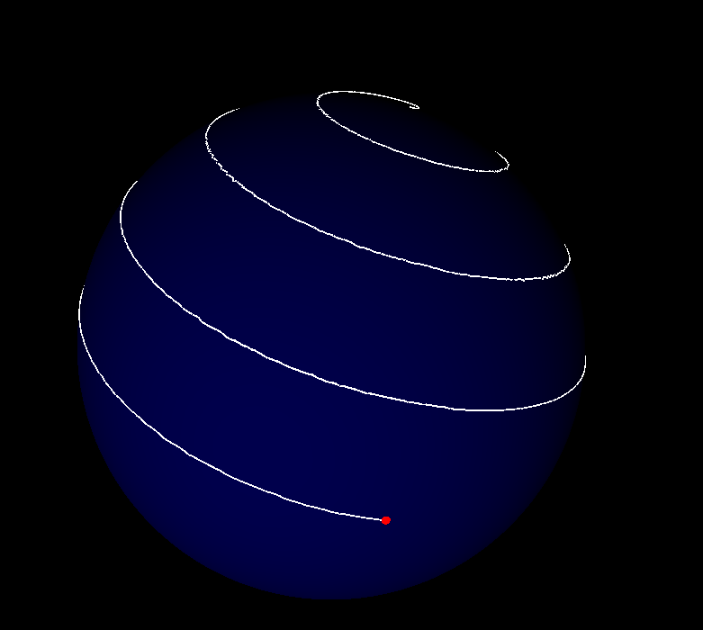

# Geometric-Phase-Visualization
Using p5.js to visualize geometric phase 
# Abstract
I used p5.js WEBGL renderer to get an animation of the dyanmic trace of path in polarization space of a photon passing through a waveplate. The resulting animation is recorded into a movie clip using another js library viz. CCapture.js.

